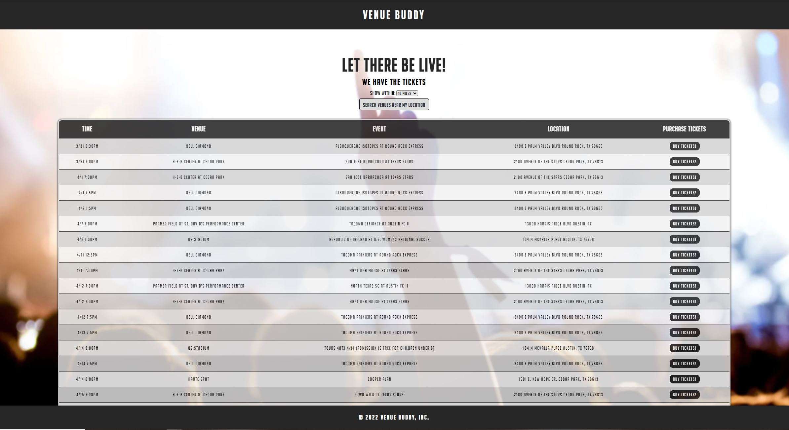

# VENUE BUDDY

The application utilizes a google location API to find the users location and then accesses the SeatGeek API to show the user events in their area.

I have not yet developed localStorage utilization. I plan to add the ability to add an address field and then allow the user to save their location.

https://venuebuddy.herokuapp.com/
